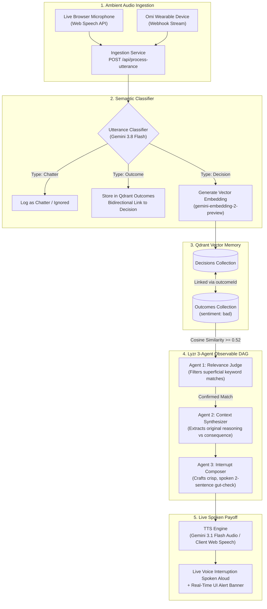

# Loopback — Live Decision Interrupt Assistant

<div align="center">

**Voice-first, memory-backed agentic assistant that listens ambiently for repeat decision traps and interrupts live mid-conversation.**

[](https://ai.google.dev/)
[](https://qdrant.tech/)
[](https://lyzr.ai/)
[](https://omi.me/)
[](https://vitejs.dev/)

</div>

---

## 🎯 The Pitch

While you talk through a decision out loud, **Loopback** listens ambiently in the background. It recognizes when your current decision echoes a past decision that led to a painful outcome—and **interrupts you live, in the moment, mid-conversation** with your original reasoning and what actually happened.

> **Not a weekly retrospective journal. A real-time, spoken gut-check grounded in your team's remembered history before you commit to the same mistake again.**

---

## 💡 Honest Novelty

Decision journals and post-mortems already catalog decisions retrospectively. Loopback's key differentiation is the **real-time, voice-triggered interrupt loop** during an active, unrelated conversation:

1. **Ambient Voice Ingestion**: Consumes streaming speech from an Omi wearable device or live browser microphone.
2. **Bidirectional Vector Linking**: Pairs past decisions with their actual consequences across two linked collections in **Qdrant**.
3. **Observable Lyzr 3-Agent DAG**: Validates genuine repeat-heuristic patterns (filtering coincidental phrasing), synthesizes historical facts, and crafts a concise, spoken 2-sentence interrupt delivered via **Gemini TTS**.

---

## 🏗️ Architecture & Pipeline



---

## 🤖 The Lyzr 3-Agent DAG

When a proposed decision has a cosine similarity match ($\ge 0.52$) with a past decision linked to a negative outcome, it triggers the **Lyzr 3-Agent DAG**:

| Agent | Name | Role | Output |
|---|---|---|---|
| **Agent 1** | **Relevance Judge** | Filters out coincidental phrasing or superficial keyword matches to verify that the user is genuinely about to repeat the underlying decision flaw. | Relevance verdict (`true`/`false`), confidence score, and category match description. |
| **Agent 2** | **Context Synthesizer** | Reconstructs the historical precedent into plain, factual language: comparing what was assumed back then against what actually occurred. | Precedent summary, original reasoning, actual consequence, and key risk. |
| **Agent 3** | **Interrupt Composer** | Composes a natural, punchy spoken interrupt (15–25 words) with urgency level and immediate gut-check action. | Spoken text, urgency (`critical`, `high`, `medium`), tone, and recommended team action. |

---

## ⚡ Key Features

- **🎙️ Ambient Audio Streaming**: Works with continuous microphone capture via Web Speech API and accepts webhook streams from [Omi](https://omi.me/) devices (`POST /api/omi-webhook`).
- **🧠 Bidirectional Qdrant Memory**: Visualizes decision nodes and linked outcome cards, showing positive vs. negative outcome badges and similarity scores.
- **🔍 Observable Agent Inspection**: Clickable DAG inspector displaying latency breakdown (search, judge, synthesis, composition), prompt outputs, and internal reasoning traces.
- **🗣️ Natural Voice Delivery**: Synthesizes audio responses using Gemini's native voice generation (`gemini-3.1-flash-tts-preview`) with seamless browser speech fallback.
- **🚀 Judge Demo Walkthrough**: Interactive, 3-step evaluation stepper built directly into the UI matching the hackathon demo protocol.

---

## 📋 Evaluation Walkthrough (Hackathon Judge Script)

The UI includes a built-in **"Judge Demo Script"** modal to test the end-to-end flow in seconds:

1. **Step 1: Past Memory Grounding**
   - Resets and seeds Qdrant memory collections (`POST /api/seed`).
   - Seeds historical precedent: *"We're picking Vendor A because they're the cheapest."*
   - Seeds linked negative outcome: *"Vendor A missed every deadline, we lost two weeks."*
2. **Step 2: The Repeat Trap**
   - Simulates a live spoken utterance in a new session:
     > *"For this new project, let's just go with the cheapest option again."*
3. **Step 3: Live Interrupt Payoff**
   - The system matches the precedent in Qdrant, runs the Lyzr 3-Agent DAG, and triggers an immediate spoken gut-check:
     > *"Last time you picked based on price alone with Vendor A, it cost you two weeks. Worth a gut-check here?"*
   - Displays the DAG execution time, similarity score, and interactive inspector.

---

## 🛠️ Tech Stack

- **Backend**: Node.js, Express, TypeScript, `tsx`
- **AI & Models**:
  - `@google/genai` SDK
  - **Gemini 3.8 Flash**: Utterance classification & Lyzr 3-Agent DAG reasoning
  - **Gemini Embedding 2 Preview**: Dense semantic vector embeddings (with fallback n-gram semantic projector)
  - **Gemini 3.1 Flash TTS Preview**: Audio interrupt synthesis
- **Vector Database**: In-memory vector store matching the Qdrant dual-collection schema (`decisions` & `outcomes`)
- **Frontend**: React 19, TypeScript, Vite 6, Tailwind CSS v4, Lucide React, Motion

---

## 🚀 Getting Started

### Prerequisites

- **Node.js** v18.0.0 or higher
- **npm** or **yarn** / **pnpm**
- A **Gemini API Key** from [Google AI Studio](https://aistudio.google.com/)

### 1. Clone & Install Dependencies

```bash
# Navigate to the project root
cd loopback---live-decision-interrupt-assistant

# Install npm packages
npm install
```

### 2. Configure Environment Variables

Create or update your `.env` file in the root directory:

```env
# Required: Google Gemini API key
GEMINI_API_KEY="your-gemini-api-key-here"

# Application URL
APP_URL="http://localhost:3000"
```

> A template is provided in [.env.example](.env.example).

### 3. Run in Development Mode

```bash
npm run dev
```

Open [http://localhost:3000](http://localhost:3000) in your browser. The Express backend and Vite frontend run together on port 3000.

### 4. Build & Run for Production

```bash
# Build frontend with Vite and server with esbuild
npm run build

# Start production server
npm run start
```

---

## 📡 API Reference

| Method | Endpoint | Description |
|---|---|---|
| `POST` | `/api/process-utterance` | Main ingestion pipeline. Classifies utterance, embeds vector, performs Qdrant similarity search, and triggers the Lyzr DAG if a repeat trap is detected. |
| `GET` | `/api/memory` | Returns all items from Qdrant `decisions` and `outcomes` collections with linked status counts. |
| `POST` | `/api/seed` | Seeds Qdrant collections with official demo script memories (Vendor A price trap, QA skip outage, canary deploy). |
| `POST` | `/api/clear-memory` | Clears all decisions and outcomes from memory. |
| `POST` | `/api/tts` | Generates spoken audio for an interrupt via Gemini TTS (`gemini-3.1-flash-tts-preview`). |
| `POST` | `/api/omi-webhook` | Webhook endpoint receiving streaming transcript chunks from an Omi device. |

---

## 📂 Project Directory Structure

```text
loopback---live-decision-interrupt-assistant/
├── .env.example                  # Environment configuration template
├── index.html                    # Root HTML document
├── metadata.json                 # AI Studio applet metadata & permissions
├── package.json                  # Dependencies and execution scripts
├── README.md                     # Project documentation
├── server.ts                     # Express server, Ingestion classifier, Qdrant store, Lyzr DAG
├── tsconfig.json                 # TypeScript compiler configuration
├── vite.config.ts                # Vite frontend configuration
└── src/
    ├── App.tsx                   # Main React application shell & live loop coordination
    ├── main.tsx                  # React entry point
    ├── index.css                 # Global CSS & Tailwind imports
    ├── types.ts                  # Shared TypeScript interfaces (Decisions, Outcomes, DAG results)
    ├── components/
    │   ├── DemoScriptModal.tsx       # 3-step Judge Demo Walkthrough interactive modal
    │   ├── InterruptBanner.tsx       # Live spoken interrupt alert banner
    │   ├── JudgeDemoStrip.tsx        # Top quick-action test strip for evaluators
    │   ├── LiveTranscriptStream.tsx  # Ambient mic & Omi webhook transcript stream
    │   ├── LyzrDagVisualizer.tsx     # Interactive 3-Agent pipeline & latency visualizer
    │   ├── Navbar.tsx                # Navigation bar with memory badges and audio controls
    │   ├── OverviewModal.tsx         # Problem statement, brief overview, & pitch deck notes
    │   ├── QdrantMemoryExplorer.tsx  # Decision-Outcome link graph explorer & precedent adder
    │   └── TransparencyModal.tsx     # Deep-dive inspector for Agent reasoning & prompt traces
    └── utils/
        └── audio.ts                  # Audio playback and Web Speech API synthesis helpers
```

